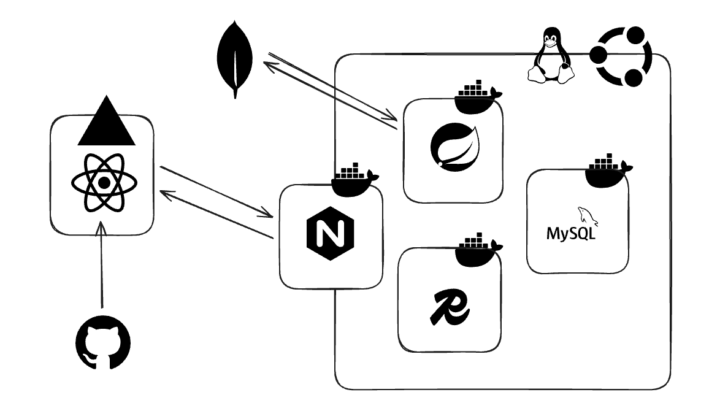

# Spring Recipe Search Engine

> **MongoDB Atlas Search 기반 레시피 검색 엔진**

- 한국어 검색 기능을 제공하도록 설계한 레시피 검색 API 서버 코드
- **MongoDB Atlas Search**와 **Lucene Nori(한국어)** 분석기를 활용

## 주요 특징

### 1. 검색 엔진 (MongoDB Atlas Search)

- Apache Lucene 기반의 **전문 검색**

- **분석기(Analyzer)**: `lucene.nori`(한국어 형태소 분석기)를 사용, 한국어의 뉘앙스 처리
    - [참고링크](https://esbook.kimjmin.net/06-text-analysis/6.7-stemming/6.7.2-nori)
- **자동 완성(Autocomplete)**
    -   **인덱스**: `autocomplete_kr` (type: `autocomplete`)
    -   **로직**: Aggregation Pipeline(`$search`, `$project`, `$reduce`) 구현
    -   **하이라이팅**: `$meta: "searchHighlights"`를 사용하여 결과 내 검색어 하이라이팅을 지원
- **통합 검색(Integrated Search)**:
    -   **인덱스**: `recipe_full_search_kr` (type: `text`)
    -   **성능**: 모든 문서를 가져오지 않고 `$searchMeta`를 활용하여 효율적으로 전체 카운트를 조회
    -   **범위**: 레시피 이름, 재료, 요리 조리법 전반에 걸친 다중 필드 검색을 지원

### 2. 비회원 식별 체계 및 보안

인증 없이 개인화 기능(북마크, 좋아요)을 제공하기 위해 `HandlerInterceptor` 기반의 익명 식별 체계를 구축

-   **비회원 식별 로직**
    -   `CookieInterceptor`를 통해 유효한 식별자 존재 여부를 검증
    -   최초 방문 시 서버에서 `UUID(36자 랜덤 문자열)`를 생성하여 클라이언트에 발급, 이를 통해 Stateless 환경에서도 비회원 활동 내역을 영속적으로 관리
-   **쿠키 보안 전략**: 민감한 식별자 정보 보호 및 크로스 도메인 이슈 해결을 위해 최신 브라우저 보안 정책을 준수
    -   **HttpOnly**: 클라이언트 사이드 스크립트(JavaScript)의 접근을 차단
    -   **Secure**: HTTPS 프로토콜 기반의 암호화 통신 시에만 쿠키가 전송되도록 강제
    -   발급된 식별자는 MySQL의 `Guest` 엔티티와 매핑되어 북마크 및 좋아요 데이터를 관계형으로 관리

### 3. 아키텍처



-   **기술 스택**: Java 17, Spring Boot 3.5.6, MongoDB, MySQL(JPA), Redis.
-   **데이터 관리**: 게스트 정보 및 활동 내역(북마크, 좋아요)은 MySQL을 통해 관계형으로 관리, 레시피 검색은 MongoDB Atlas Search를 활용
-   **캐싱**: 자주 액세스하는 데이터를 캐싱하여 데이터베이스 부하를 줄이기 위해 Redis를 통합

## 인프라 및 설정

### 사전 요구 사항

-   Java 17 이상
-   Docker 및 Docker Compose

### MongoDB Atlas Search 인덱스 구성

**1. `autocomplete_kr` (자동 완성용)**

```json
{
  "mappings": {
    "dynamic": false,
    "fields": {
      "ingredientList": [
        {
          "type": "autocomplete",
          "analyzer": "lucene.nori",
          "tokenization": "edgeGram",
          "minGrams": 1,
          "maxGrams": 10
        },
        {
          "type": "string",
          "analyzer": "lucene.nori"
        }
      ],
      "recipeName": [
        {
          "type": "autocomplete",
          "analyzer": "lucene.nori",
          "tokenization": "edgeGram",
          "minGrams": 1,
          "maxGrams": 15
        },
        {
          "type": "string",
          "analyzer": "lucene.nori"
        }
      ]
    }
  }
}
```

**2. `recipe_full_search_kr` (통합 검색용)**

```json
{
  "mappings": {
    "dynamic": false,
    "fields": {
      "recipeName": {
        "type": "string",
        "analyzer": "lucene.nori"
      },
      "ingredientList": {
        "type": "string",
        "analyzer": "lucene.nori"
      },
      "cookingOrderList": {
        "type": "document",
        "fields": {
          "instruction": {
            "type": "string",
            "analyzer": "lucene.nori"
          }
        }
      }
    }
  }
}
```


## 프로젝트 구조

```
src/main/java/com/HeoJin/RecipeSearchEngine/
├── autocomplete/       # 자동 완성 로직 (Controller, Service, Repository)
├── basicSearch/        # 기본 CRUD 및 목록 조회
├── IntegratedSearch/   # 전문 검색 로직
├── guest/              # 게스트 사용자 관리 및 개인화
└── global/             # 설정, 예외 처리, 인터셉터 (쿠키 처리)
```

### MongoDB Atlas M0 Tier 제한 사항 (참고)

**MongoDB Atlas M0(Free Tier)** 환경을 기준으로 하며, 다음의 주요 제한 사항 내에서 최적화

- **네트워크**: 7일 기준 입/출력 각 10GB 제한 (초과 시 속도 제한 및 지연 발생).
- **저장 공간**: 최대 512MB (데이터 및 인덱스 합산).
- **연산 및 정렬**: 쿼리 수행 시 메모리 내 정렬 한도 32MB
- **집계 파이프라인**: 단일 파이프라인 내 최대 50개 단계(Stage)로 제한.